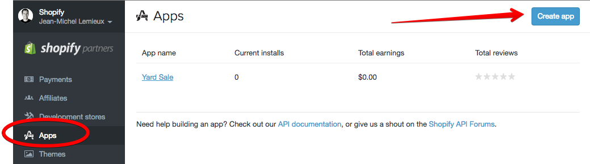

# Shopify Yard Sale App

The yard sale app allows you to sell personal online items without having to deal with the frustrating logistical hassles of Craigslist style marketplaces. Whether you’re selling in Australia on Gumtree or in France on LeBonCoin, use them as a marketing channel not a commerce platform.

Gone are the days of listing an item and getting dozen of text messages from potential buyers. Having to track who contacted you first and who wanted to pay more. Let Shopify handle the logistics, while you collect the money.

This is what it used to feel like when selling on-line:


Instead, when a product is reserved buyers can add themselves to a waitlist or propose a new price.


As a merchant, you can manage the waitlists by product. See who's raise, and automatically send mails and manage the demand all in one place.

 


# Main Features

* Allows buyers to reserve a product, and pay via COD.

* When an item is reserved, other interested buyers can add themselves to a waiting list in-case the first buyer backs out (which is very common in yard sales).

* Allows waitlisted buyers to submit a bid on a reserved item. The app manages the notifications to the current buyer for a right to match the bid and then transferring the order to the new buyer.

* If a buyer backs out of purchasing an item, the admin interface allows you to release an item and notify everyone on the waiting list that it’s now available. The app supports two release options.

* The first clears the waiting list and sends an e-mail to the waitlist that the item is now back on the market. In this case it’s first come first serve regardless of which position in line they where.

* The second release option is sequential. It notifies the next person in line that they can purchase the item and you can keep the waiting list intact and notify by mail that they have rights to the item now.

# Development

### Dev Store and App Setup

Install [localtunnel](http://localtunnel.me/) so that during development you can receive proxy redirects and webhooks.

```
$ npm install -g localtunnel
```

Select a unique subdomain and start the tunnel.

```
$ lt --port 3000 --subdomain <yoursubdomain>
your url is: https://<yoursubdomain>.localtunnel.me
```

Register as a Shopify partner and [create a dev shop](https://docs.shopify.com/themes/theme-development/getting-started/development-environment). You'll have to create your own app listing under your partner account to develop an app locally. Go create one `https://app.shopify.com/services/partners/api_clients` from your partners dashboard.



After the app's been created, remember the api and secret keys and install in your `shopify_app.xml`.

```
cp config/shopify_app.yml.example config/shopify_app.yml
```


Next, edit the app settings and turn on support for the embedded sdk which allows your app to customize the administration sections of a shop.


Lastly, setup a proxy for the app so that it can connect to your local instance via the tunnel.


### Running Locally

Now, you're ready to run the app locally and install it into a shop.

After cloning the app repository, install gems and environment variable with tunnel hostname and start the server.

```
$ bundle install
$ export AYS_APP_URL=https://<yoursubdomain>.localtunnel.me
$ bundle exec rails server
```

Once your test store is created, log into the admin and goto your apps page `https://<yourdevstore>.myshopify.com/admin/apps`.

In development mode, you can't install the app running locally from the app store. Instead, register it manually by hitting the URL below in your browser.

```
https://<yoursubdomain>.localtunnel.me/login?shop=<yourdevstore>.myshopify.com
```

You'll be redirected to a confirmation page, click "Install Yard Sale"


During the installation process you should see handshake log messages from your local app in the console. Then, after successful install an entry will show up in the apps page of your store admin. Your image and icon will differ a it's configured in the app configuration and not included in the source of the app itself.


# Wish List

There are more than purchases logistics to deal with when selling many personal things on different marketplaces. In the pro version of yard sale, we support Channels and allow you to automate the menial tasks of pricing and marketing in various sites.

### Pricing

- See the price range in a specific channel for an equivalently named product. This allows you to set the price based going market rates.
- Set prices based on relative range of market (eg, 10% more or 10% less)

### Ad Purchasing

- Manage ad purchasing and analytics to multiple channels.
- Post and purchase ads directly from within Shopify.
- Renew the ads as long as the product is still available.
- Link directly to a pre-filled cart (aka Buy Button release on March 31st).
